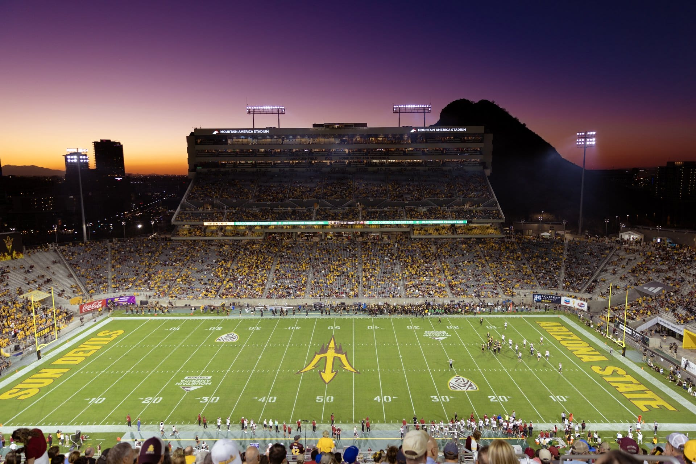
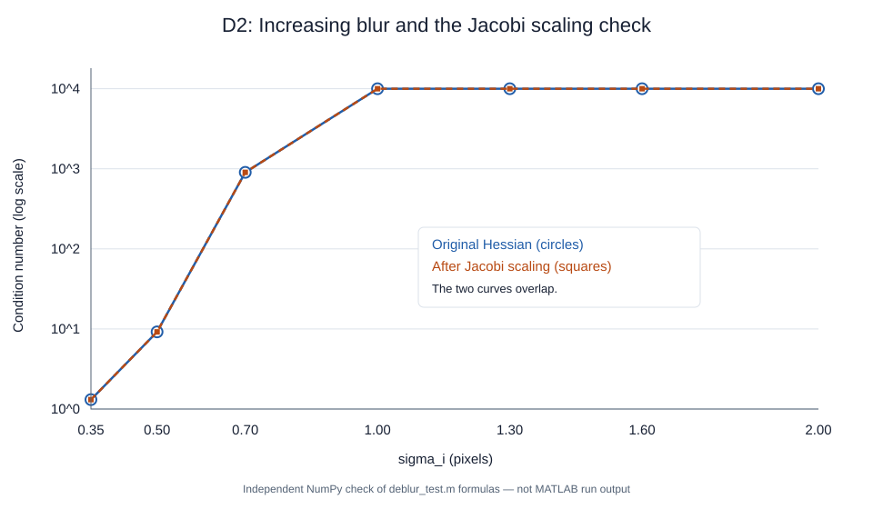
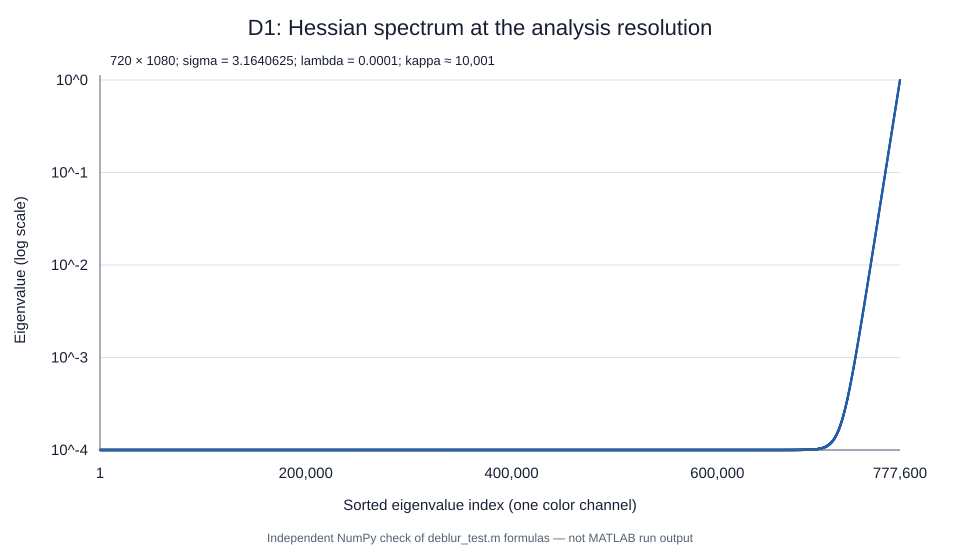

# MAE 494 Fall 2026 — Project 2

Team Name: AI Generated

Contributors: Jack Foster, Danny Lewis

Topic: Ill-Conditioned Optimization in Color Image Deblurring

Assignment: [Project 2 requirements](https://designinformaticslab.github.io/DesignOptimization2025/project2.html)

Implementation: [deblur_test.m](deblur_test.m) | Input: [Test_Image.jpg](Test_Image.jpg)

> Working report based on the existing MATLAB script and the supplied image. The mathematical formulation and D1/D2 checks are developed below. MATLAB execution was blocked by a MathWorks service error, so convergence counts, reconstruction errors, and reconstructed images are still pending. The MATLAB code and its model parameters have not been changed.

## Problem Identification

A blurred photograph may preserve the overall scene while hiding details such as lettering, field markings, and individual rows of seats. Someone trying to recover useful information from that photograph needs an estimate of the image before the blur occurred. Simply sharpening the picture does not explain whether that estimate is consistent with the blur or how sensitive it is to noise.

Our project studies this problem using the supplied stadium photograph. The broad areas of sky and field vary gradually, while the stadium lettering, seating, and yard lines contain sharper changes. This makes the image useful for explaining why recovering fine detail is harder than recovering broad features.



*Figure 1. The supplied 1920 × 1281 RGB photograph. This is the input reference, not a reconstruction result.*

The script creates a controlled experiment: it resizes this reference, applies a known Gaussian blur, adds noise, and then estimates the reference image from the degraded image. It therefore tests recovery from **synthetically added blur and noise**. It does not estimate an unknown blur from a photograph taken by an actual blurred camera.

The optimization question is: which pixel values best explain the blurred image while limiting the size of the reconstructed values? The numerical question is why gradient descent can converge slowly on this problem, and whether conjugate gradient handles the same objective more effectively.

## Decision Variables

The decision variable $x$, already used in the script's formulation, represents the reconstructed pixel intensities. These are continuous, dimensionless values expressed on the normalized image-intensity scale.

For the analysis image, all three color channels can be understood as a single vector:

$$x \in \mathbb{R}^{3\,\text{nRows}\,\text{nCols}}.$$

MATLAB stores the image as an array and handles the channels separately where appropriate. This vector notation only explains the existing computation; it does not introduce another variable or change the model. The norms in the objective below mean Euclidean norms over the pixel values.

| Existing image variable | Role | Dimensions: width × height × channels |
| --- | --- | --- |
| `img` | Supplied image after conversion to double precision | 1920 × 1281 × 3 |
| `xTrue2K` | Resized reference for the direct Fourier solve | 2048 × 1366 × 3 |
| `xTrue` | Resized reference for iterative diagnostics | 1080 × 720 × 3 |
| `xDeblur2K` | Direct reconstruction at the larger resolution | 2048 × 1366 × 3 |
| `xGD`, `xCG` | Reconstructions used in the optimizer comparison | 1080 × 720 × 3 |

The analysis problem has 2,332,800 scalar pixel values. The larger reconstruction has 8,392,704. These dimensions follow from the supplied image and the script's rounding rules; increasing the image width to 2048 does not create new photographic detail.

## Objective Function

The script specifies Tikhonov-regularized least squares:

$$\min_x f(x) = \frac{1}{2}\lVert Ax-b\rVert_2^2 + \frac{\lambda}{2}\lVert x\rVert_2^2.$$

The first term measures whether applying the blur to the reconstructed image reproduces the observed image. The second penalizes large reconstructed pixel values. It limits the amplification that can occur when attempting to recover information strongly suppressed by blur, but it also biases the solution. The code uses an intensity penalty, not a separate penalty on image derivatives.

The regularization value is fixed at `lambda = 1e-4`. It is a parameter, not a quantity that the optimizer chooses.

For this objective, the gradient and Hessian are

$$\nabla f(x) = A^\top(Ax-b)+\lambda x,$$

$$H = A^\top A+\lambda I.$$

Setting the gradient to zero gives the system solved by the reconstruction methods:

$$(A^\top A+\lambda I)x=A^\top b.$$

Here $I$ is the identity operator already present in the script's mathematical description. The implementation does not build a dense matrix for $A$ or $H$; it applies their action using Fourier transforms.

## Additional Definitions

| Existing symbol or code name | Meaning and setting |
| --- | --- |
| $A$ | Gaussian circular-convolution operator, applied independently to each color channel |
| $b$, `b2K` | Blurred images with added Gaussian noise at the analysis and larger resolutions |
| `psf`, `psf2K` | Gaussian blur kernels normalized so their entries sum to one |
| `Hf`, `Hf2K` | Fourier transforms of the shifted blur kernels; these are not the Hessian $H$ |
| `sigma2K` | Gaussian standard deviation of 6 pixels in the larger image |
| `sigma` | Analysis blur standard deviation: `sigma2K*analysisScale` = 3.1640625 pixels |
| `noiseStd` | Added noise standard deviation of 0.001 in normalized intensity units |
| `lambda` | Fixed regularization weight, 0.0001 |
| `eigH`, `hEig` | Arrays containing `abs(Hf).^2 + lambda` |
| `lambdaMin`, `lambdaMax` | Smallest and largest Hessian eigenvalues, distinct from the regularization weight |
| `kappa` | Ratio `lambdaMax/lambdaMin` |
| `alpha` | Fixed gradient-descent step, `2/(lambdaMax + lambdaMin)` |

Although a code comment calls `sigma2K` a blur radius, the Gaussian expression uses it as a **standard deviation**. It is not a finite cutoff radius.

The script first forms `b2K` from `xTrue2K`. It later resizes the reference to `xTrue` and generates `b` with a fresh noise draw. The analysis observation is therefore not simply a downsampled copy of `b2K`.

## Constraints

The optimization is unconstrained: there are no equality constraints, inequality constraints, integer restrictions, or enforced pixel bounds on $x$.

The `clampImage` function clips values to the interval $[0,1]$ for display. It is applied after solving, rather than as a projection within GD or CG. Consequently, clipping should not be described as a constraint in the optimization formulation. The input to each solver is the unclipped noisy image.

## Classification

This is a continuous, unconstrained, strongly convex quadratic optimization problem. The forward blur model is linear, while the objective is quadratic; this is not a linear programming problem.

The matrix $A^\top A$ is positive semidefinite. Adding the positive `lambda` to every eigenvalue makes $H$ positive definite, so the regularized objective has a unique minimizer. A unique solution can still be difficult to reach with a particular algorithm when the curvature differs greatly between directions.

## Ill-Conditioning Mechanism

The assignment places image deblurring in **family B**. For this implementation, the source of poor conditioning is the Gaussian blur operator's suppression of spatial detail. See the assignment's [problem menu](https://designinformaticslab.github.io/DesignOptimization2025/project2.html#the-full-menu).

In the stadium image, smooth sky gradients represent slowly varying features. Fine lettering and seat patterns change more rapidly across pixels. The blur weakens those rapidly varying components, so changing them in a candidate reconstruction can produce very little change in the blurred result. The objective is therefore much flatter in some directions than in others.

The code computes the Hessian eigenvalues directly in the Fourier basis:

```matlab
eigH = abs(Hf).^2 + lambda;
lambdaMin = min(eigH(:));
lambdaMax = max(eigH(:));
kappa = lambdaMax/lambdaMin;
```

Squaring the transfer-function magnitude corresponds to $A^\top A$; adding `lambda` shifts every eigenvalue upward. Because the nonnegative blur kernel sums to one, its response to a constant image is one and no Fourier magnitude exceeds one. Thus the largest Hessian eigenvalue is $1+\lambda$, while the smallest is at least $\lambda$:

$$\kappa(H)\le\frac{1+\lambda}{\lambda}=10001.$$

This explains both the large condition number and its upper limit for the current fixed regularization. More blur does not make the regularized condition number grow without bound.

### D2 — Intrinsic Conditioning

The existing `sigmaList` varies the blur width while holding the analysis dimensions and `lambda` fixed. The following values are **independent NumPy evaluations of the existing MATLAB formulas**, not recorded MATLAB execution results. The image pixels and random noise are not needed for these Hessian calculations.

| `sigma_i` (pixels) | `kappaOriginal` | `kappaJacobi` |
| --- | ---: | ---: |
| 0.35 | 1.31016 | 1.31016 |
| 0.50 | 9.19180 | 9.19180 |
| 0.70 | 902.89698 | 902.89698 |
| 1.00 | 9996.72094 | 9996.72094 |
| 1.30 | 10000.99999 | 10000.99999 |
| 1.60 | 10001.00000 | 10001.00000 |
| 2.00 | 10001.00000 | 10001.00000 |



*Figure 2. Independent check of the script's D2 formulas. The original and rescaled curves overlap. Values near the upper limit have been rounded.*

The table shows substantial growth from weak to stronger blur, followed by saturation near the regularization limit. The sweep ends at 2 pixels; the main analysis setting, 3.1640625 pixels, is separate and lies beyond that sweep.

For circular convolution, each pixel is treated by the same shifted kernel. Every diagonal entry of the spatial Hessian is therefore the same. The script calculates this shared value and the rescaled eigenvalues using

```matlab
diagH = sum(psf_i(:).^2) + lambda;
eigScaled = eigHi/diagH;
```

All eigenvalues are divided by the same positive scalar, so their largest-to-smallest ratio does not change. Diagonal scaling cannot remove the large condition number in this model. This is the structural issue tested by the assignment, rather than a mismatch between the units of different pixels.

## Effect of Ill-Conditioning

### D1 — Spectrum

At `sigma = 3.1640625`, the independent check gives:

| Existing quantity | Checked value |
| --- | ---: |
| `lambdaMin` | Approximately 0.0001 |
| `lambdaMax` | Approximately 1.0001 |
| `kappa` | Approximately 10001 |
| `alpha` | Approximately 1.99960008 |



*Figure 3. Independent check of the D1 spectrum, using the script's 10,000-point sampling rule. The eigenvalues belong to one color channel; all three channels have the same spectrum.*

Many eigenvalues lie near the regularization floor, while a smaller portion extends toward 1.0001. This wide range is the numerical expression of the difference between weakly observed detail and strongly observed broad image features.

### D3 — Baseline: Gradient Descent

The baseline is fixed-step gradient descent, represented in the Fourier basis. The script evaluates its trajectory from a zero initial image without explicitly executing every spatial-domain iteration:

```matlab
alpha = 2/(lambdaMax + lambdaMin);
hEig = abs(Hf).^2 + lambda;
rho = 1 - alpha*hEig;
```

`rho` describes how each Fourier component of the error changes in one iteration. Components with magnitude close to one decay slowly. The code calculates `relativeGradientGD` from `rhsEnergy` and powers of `absRho`, summing across all three channels. Fourier normalization cancels in this relative norm.

For the checked spectrum, the largest magnitude of `rho` is about 0.99980004. Raising that factor to 20,000 gives about 0.018323. This describes a worst-mode contraction factor, **not a measured gradient residual or reconstruction error for the photograph**. It explains why the script's 20,000-iteration limit does not guarantee the requested tolerance.

The existing controls are `gdTolerance = 1e-4` and `maxGDIterations = 20000`. Iterations are sampled logarithmically. If a sampled value first passes the tolerance, `gdIterations` reports that sampled index, not necessarily the earliest successful iteration. If no sample passes, it is set to 20,000 and the script prints a failure-to-converge message. That value must not be reported as successful convergence without checking the message.

**Result still needed:** export the existing GD convergence figure and record whether the tolerance was reached. A two-variable contour-path plot is not applicable to this image with millions of decision values.

## Proposed Solution and Demonstration

### D4 — Improvement: Conjugate Gradient

The proposed optimizer comparison is conjugate gradient on the same regularized normal equations. It uses the Hessian's structure to construct conjugate search directions rather than repeatedly following the steepest-descent direction. This can reduce the number of iterations needed for an ill-conditioned positive-definite quadratic.

The implementation uses `pcg` with `cgTolerance = 1e-4` and `maxCGIterations = 500`. Despite the function name, the call supplies **no preconditioner**. It is an unpreconditioned CG comparison. The default initial estimate is zero, and the three color channels are solved separately.

The Fourier representation makes the Hessian-vector operation inexpensive through `Hmult`. It does not change the Hessian eigenvalues or reduce `kappa`. The improvement to demonstrate here is convergence behavior, not a claim that the change of basis cured the conditioning.

For each channel, the script prints `iterationsCG`, `relres`, and `flag`. A zero flag indicates successful convergence; the iteration count alone is insufficient to establish success. `maxCGUsed` is the largest per-channel count, not the sum of work across all channels.

**Comparison limitation:** `relativeGradientGD` combines RGB gradient energy, but `cgHistory` stores only the first channel's normalized residual history. The two plotted curves therefore do not measure exactly the same aggregate. Explain this when presenting the existing figure; it cannot support a precise whole-image speedup ratio. No code changes have been made to resolve this gap.

### Larger Image: Direct Fourier Reconstruction

The 2048-pixel-wide reconstruction uses `spectralDeblurRGB`, not CG. In each color channel, it computes

```matlab
Xf = conj(Hf).*Bf ./ (abs(Hf).^2 + lambda);
```

and transforms the result back to pixel space. This directly solves the regularized normal equations for the periodic blur model. The resulting `xDeblur2K` is separate from the smaller `xCG` image.

`directSolveTime` measures this direct solve. The script does not time GD and CG, and GD is evaluated through sampled closed-form expressions. A wall-clock comparison between these paths would not measure equivalent iterative implementations.

### Reconstruction Quality and Pending Results

Optimization accuracy and photographic fidelity are different. A small gradient or residual means the regularized equations have nearly been solved; it does not mean the original photograph has been recovered exactly.

The script's `errorBlur`, `errorGD`, `errorCG`, and `error2K` are relative image errors against the corresponding resized reference. These errors use **clipped display images**. They are not objective-function values or solver residuals, and the larger-image error is measured at a different resolution from the iterative errors.

| Result from the current script | Status |
| --- | --- |
| GD tolerance success and sampled iteration count | Awaiting MATLAB execution |
| CG convergence flag, residual, and iteration count for each channel | Awaiting MATLAB execution |
| GD/CG convergence figure | Awaiting MATLAB export; retain the RGB/red-channel caveat |
| Smaller-image reconstruction comparison | Awaiting MATLAB export |
| Direct 2K reconstruction and `directSolveTime` | Awaiting MATLAB execution and export |
| `errorBlur`, `errorGD`, `errorCG`, `error2K` | Awaiting MATLAB execution |

## Assumptions and Simplifications

The following choices already exist in the script; no additional model assumptions are introduced here.

- **Known, spatially uniform Gaussian blur.** The same kernel applies throughout an image and independently to each channel. The experiment does not estimate a spatially varying blur or motion blur.
- **Periodic boundaries.** Fourier multiplication implements circular convolution, so opposite image edges interact. The stadium photograph is not inherently periodic; this may affect its boundary reconstruction.
- **Synthetic Gaussian noise.** Noise is generated by `randn` with `noiseStd = 0.001` and a fixed `rng(1)` seed. This does not model every source of camera noise or compression artifacts.
- **Fixed regularization.** The script uses `lambda = 1e-4` without a parameter-selection study. Better conditioning is obtained at the cost of regularization bias; the code does not establish this value as optimal.
- **Resized reference images.** The input is treated as the known reference after resizing. Its pre-existing photographic imperfections remain part of that reference.
- **Separate analysis resolution.** Diagnostics use 1080-pixel width and the corresponding scaled blur. The same mathematical form is retained, but the diagnostic image and noise realization differ from the larger case.
- **Post-solve clipping.** Display clipping affects the reported image errors without changing the unconstrained solution process.

## Reproducibility

The reviewed GitHub and local versions of `deblur_test.m` matched after ignoring line endings. The source image is `Test_Image.jpg`; there is no `stadium.png` in the reviewed repository.

To run the existing script:

1. Use MATLAB with the Image Processing Toolbox and set the Current Folder to this repository.
2. Run `deblur_test`.
3. When the image picker appears, choose `Test_Image.jpg`. The script first searches for `stadium.png`, then falls back to this picker.
4. Run the complete script so `rng(1)`, both image sizes, and both noise draws follow the existing sequence.
5. Save the Command Window output and export the named spectrum, conditioning, convergence, and reconstruction figures. The current script displays these figures but does not save report assets automatically.

The D1/D2 tables and figures above were checked separately with NumPy 2.3.5, using the exact Gaussian-kernel formula, dimensions, `sigmaList`, and `lambda` from the script. No synthetic image reconstructions or solver results were substituted for MATLAB output. Numeric check data are saved in [conditioning-check.json](report_assets/conditioning-check.json).

MATLAB R2023b was found locally, but startup failed with MathWorks service error 5202. This prevents an end-to-end execution claim for this draft. The independent conditioning check confirms the spectral formulas, not the complete MATLAB pipeline.

## Remaining Work Before Submission

The [assignment](https://designinformaticslab.github.io/DesignOptimization2025/project2.html#report-requirements) calls for formulation, conditioning evidence, baseline behavior, and a demonstrated remedy. This draft maps those requirements to the actual implementation:

| Report component | Current evidence | Remaining work |
| --- | --- | --- |
| Formulation and classification | Objective, variables, constraints, and positive-definite Hessian explained from code | Team review |
| D1 and D2 | Independent spectral/conditioning checks and figures | Compare with MATLAB output; add the requested small-case hand verification |
| D3 | GD trajectory and stopping logic explained | Record actual convergence evidence |
| D4 | CG and direct-solve roles distinguished | Record CG results and disclose the current channel mismatch |
| Reproducibility | Existing settings and run instructions documented | Preserve MATLAB logs/figures and software details |

Before submission, confirm that equations and images render correctly on GitHub, replace pending results with verified output, and submit the public repository link on Canvas. The present file is a developed report draft, not a claim that the outstanding experiments have been completed.
