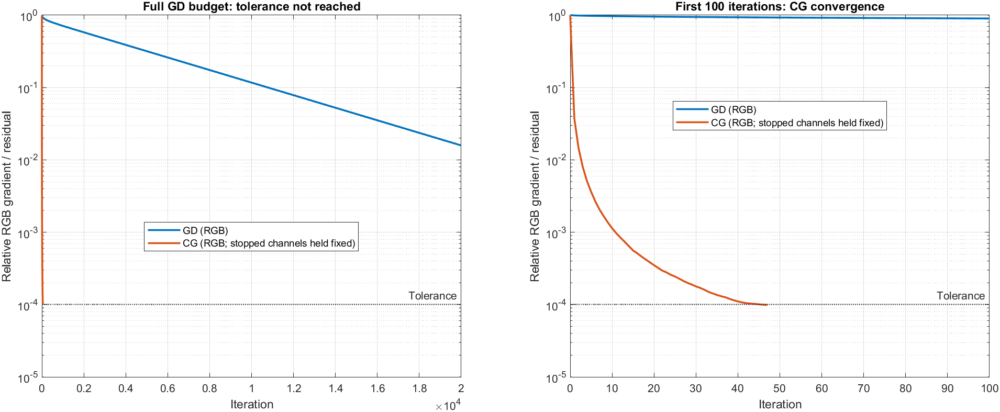
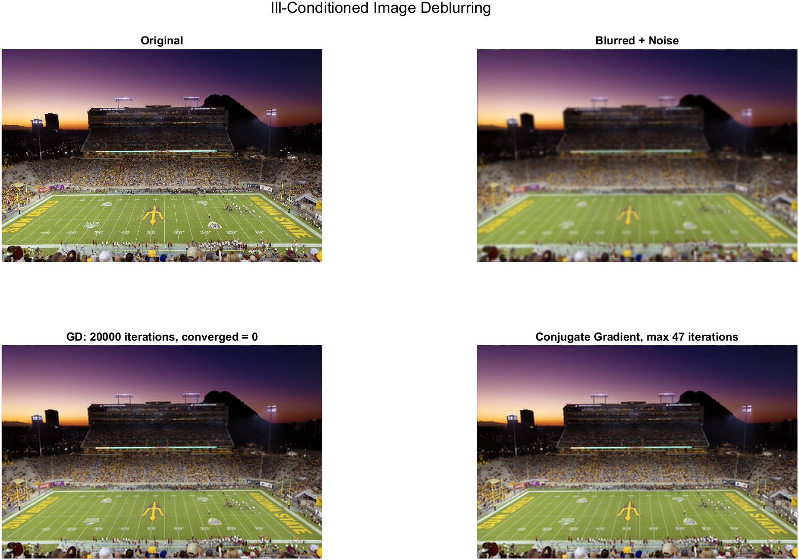
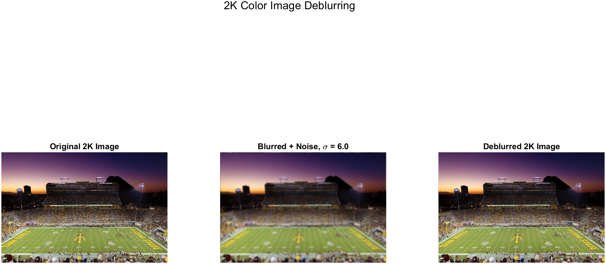

# MAE 494 Fall 2026 — Project 2

Team Name: AI Generated

Contributors: Jack Foster, Danny Lewis

Topic: Ill-Conditioned Optimization in Color Image Deblurring

Assignment: [Project 2 requirements](https://designinformaticslab.github.io/DesignOptimization2025/project2.html)

Original: [deblur_test.m](deblur_test.m) | Working copy: [deblur_report.m](analysis/deblur_report.m) | Python: [deblur_report.py](analysis/deblur_report.py) | Input: [Test_Image.jpg](Test_Image.jpg)

> This report now includes a successful MATLAB run and a validated Python translation. The original `deblur_test.m` is unchanged. A separate working copy improves diagnostic reporting and exports without changing the model or its parameters. Measured results below come from the MATLAB copy; independent checks are labeled separately.

## Problem Identification

A blurred photograph may preserve the overall scene while hiding details such as lettering, field markings, and individual rows of seats. Someone trying to recover useful information from that photograph needs an estimate of the image before the blur occurred. Simply sharpening the picture does not explain whether that estimate is consistent with the blur or how sensitive it is to noise.

Our project studies this problem using the supplied stadium photograph. The broad areas of sky and field vary gradually, while the stadium lettering, seating, and yard lines contain sharper changes. This makes the image useful for explaining why recovering fine detail is harder than recovering broad features.


*Figure 1. The supplied 1920 × 1281 RGB photograph. This is the input reference, not a reconstruction result.*

The script creates a controlled experiment: it resizes this reference, applies a known Gaussian blur, adds noise, and then estimates the reference image from the degraded image. It therefore tests recovery from **synthetically added blur and noise**. It does not estimate an unknown blur from a photograph taken by an actual blurred camera.

The optimization question is: which pixel values best explain the blurred image while limiting the size of the reconstructed values? The numerical question is why gradient descent can converge slowly on this problem, and whether conjugate gradient handles the same objective more effectively.

## Decision Variables

The decision variable $x$, already used in the script's formulation, represents the reconstructed pixel intensities. These are continuous, dimensionless values expressed on the normalized image-intensity scale.

For the analysis image, all three color channels can be understood as a single vector:

$$x \in \mathbb{R}^{3\,\text{nRows}\,\text{nCols}}.$$

MATLAB stores the image as an array and handles the channels separately where appropriate. This vector notation only explains the existing computation; it does not introduce another variable or change the model. The norms in the objective below mean Euclidean norms over the pixel values.

| Existing image variable | Role | Dimensions: width × height × channels |
| --- | --- | --- |
| `img` | Supplied image after conversion to double precision | 1920 × 1281 × 3 |
| `xTrue2K` | Resized reference for the direct Fourier solve | 2048 × 1366 × 3 |
| `xTrue` | Resized reference for iterative diagnostics | 1080 × 720 × 3 |
| `xDeblur2K` | Direct reconstruction at the larger resolution | 2048 × 1366 × 3 |
| `xGD`, `xCG` | Reconstructions used in the optimizer comparison | 1080 × 720 × 3 |

The analysis problem has 2,332,800 scalar pixel values. The larger reconstruction has 8,392,704. These dimensions follow from the supplied image and the script's rounding rules; increasing the image width to 2048 does not create new photographic detail.

## Objective Function

The script specifies Tikhonov-regularized least squares:

$$\min_x f(x) = \frac{1}{2}\lVert Ax-b\rVert_2^2 + \frac{\lambda}{2}\lVert x\rVert_2^2.$$

The first term measures whether applying the blur to the reconstructed image reproduces the observed image. The second penalizes large reconstructed pixel values. It limits the amplification that can occur when attempting to recover information strongly suppressed by blur, but it also biases the solution. The code uses an intensity penalty, not a separate penalty on image derivatives.

The regularization value is fixed at `lambda = 1e-4`. It is a parameter, not a quantity that the optimizer chooses.

For this objective, the gradient and Hessian are

$$\nabla f(x) = A^\top(Ax-b)+\lambda x,$$

$$H = A^\top A+\lambda I.$$

Setting the gradient to zero gives the system solved by the reconstruction methods:

$$(A^\top A+\lambda I)x=A^\top b.$$

Here $I$ is the identity operator already present in the script's mathematical description. The implementation does not build a dense matrix for $A$ or $H$; it applies their action using Fourier transforms.

## Additional Definitions

| Existing symbol or code name | Meaning and setting |
| --- | --- |
| $A$ | Gaussian circular-convolution operator, applied independently to each color channel |
| $b$, `b2K` | Blurred images with added Gaussian noise at the analysis and larger resolutions |
| `psf`, `psf2K` | Gaussian blur kernels normalized so their entries sum to one |
| `Hf`, `Hf2K` | Fourier transforms of the shifted blur kernels; these are not the Hessian $H$ |
| `sigma2K` | Gaussian standard deviation of 6 pixels in the larger image |
| `sigma` | Analysis blur standard deviation: `sigma2K*analysisScale` = 3.1640625 pixels |
| `noiseStd` | Added noise standard deviation of 0.001 in normalized intensity units |
| `lambda` | Fixed regularization weight, 0.0001 |
| `eigH`, `hEig` | Arrays containing `abs(Hf).^2 + lambda` |
| `lambdaMin`, `lambdaMax` | Smallest and largest Hessian eigenvalues, distinct from the regularization weight |
| `kappa` | Ratio `lambdaMax/lambdaMin` |
| `alpha` | Fixed gradient-descent step, `2/(lambdaMax + lambdaMin)` |

Although a code comment calls `sigma2K` a blur radius, the Gaussian expression uses it as a **standard deviation**. It is not a finite cutoff radius.

The script first forms `b2K` from `xTrue2K`. It later resizes the reference to `xTrue` and generates `b` with a fresh noise draw. The analysis observation is therefore not simply a downsampled copy of `b2K`.

## Constraints

The optimization is unconstrained: there are no equality constraints, inequality constraints, integer restrictions, or enforced pixel bounds on $x$.

The `clampImage` function clips values to the interval $[0,1]$ for display. It is applied after solving, rather than as a projection within GD or CG. Consequently, clipping should not be described as a constraint in the optimization formulation. The input to each solver is the unclipped noisy image.

## Classification

This is a continuous, unconstrained, strongly convex quadratic optimization problem. The forward blur model is linear, while the objective is quadratic; this is not a linear programming problem.

The matrix $A^\top A$ is positive semidefinite. Adding the positive `lambda` to every eigenvalue makes $H$ positive definite, so the regularized objective has a unique minimizer. A unique solution can still be difficult to reach with a particular algorithm when the curvature differs greatly between directions.

## Ill-Conditioning Mechanism

The assignment places image deblurring in **family B**. For this implementation, the source of poor conditioning is the Gaussian blur operator's suppression of spatial detail. See the assignment's [problem menu](https://designinformaticslab.github.io/DesignOptimization2025/project2.html#the-full-menu).

In the stadium image, smooth sky gradients represent slowly varying features. Fine lettering and seat patterns change more rapidly across pixels. The blur weakens those rapidly varying components, so changing them in a candidate reconstruction can produce very little change in the blurred result. The objective is therefore much flatter in some directions than in others.

The code computes the Hessian eigenvalues directly in the Fourier basis:

```matlab
eigH = abs(Hf).^2 + lambda;
lambdaMin = min(eigH(:));
lambdaMax = max(eigH(:));
kappa = lambdaMax/lambdaMin;
```

Squaring the transfer-function magnitude corresponds to $A^\top A$; adding `lambda` shifts every eigenvalue upward. Because the nonnegative blur kernel sums to one, its response to a constant image is one and no Fourier magnitude exceeds one. Thus the largest Hessian eigenvalue is $1+\lambda$, while the smallest is at least $\lambda$:

$$\kappa(H)\le\frac{1+\lambda}{\lambda}=10001.$$

This explains both the large condition number and its upper limit for the current fixed regularization. More blur does not make the regularized condition number grow without bound.

### D2 — Intrinsic Conditioning

The existing `sigmaList` varies the blur width while holding the analysis dimensions and `lambda` fixed. The following values were first checked independently with NumPy and then confirmed by the MATLAB working-copy run; see the [saved MATLAB results](report_assets/matlab-run/results.json). The image pixels and random noise are not needed for these Hessian calculations.

| `sigma_i` (pixels) | `kappaOriginal` | `kappaJacobi` |
| --- | ---: | ---: |
| 0.35 | 1.31016 | 1.31016 |
| 0.50 | 9.19180 | 9.19180 |
| 0.70 | 902.89698 | 902.89698 |
| 1.00 | 9996.72094 | 9996.72094 |
| 1.30 | 10000.99999 | 10000.99999 |
| 1.60 | 10001.00000 | 10001.00000 |
| 2.00 | 10001.00000 | 10001.00000 |


*Figure 2. Independent check of the script's D2 formulas. The original and rescaled curves overlap. Values near the upper limit have been rounded.*

The table shows substantial growth from weak to stronger blur, followed by saturation near the regularization limit. The sweep ends at 2 pixels; the main analysis setting, 3.1640625 pixels, is separate and lies beyond that sweep.

For circular convolution, each pixel is treated by the same shifted kernel. Every diagonal entry of the spatial Hessian is therefore the same. The script calculates this shared value and the rescaled eigenvalues using

```matlab
diagH = sum(psf_i(:).^2) + lambda;
eigScaled = eigHi/diagH;
```

All eigenvalues are divided by the same positive scalar, so their largest-to-smallest ratio does not change. Diagonal scaling cannot remove the large condition number in this model. This is the structural issue tested by the assignment, rather than a mismatch between the units of different pixels.

## Effect of Ill-Conditioning

### D1 — Spectrum

At `sigma = 3.1640625`, the MATLAB run confirms the independent check:

| Existing quantity | Checked value |
| --- | ---: |
| `lambdaMin` | Approximately 0.0001 |
| `lambdaMax` | Approximately 1.0001 |
| `kappa` | Approximately 10001 |
| `alpha` | Approximately 1.99960008 |


*Figure 3. Independent check of the D1 spectrum, using the script's 10,000-point sampling rule. The eigenvalues belong to one color channel; all three channels have the same spectrum.*

Many eigenvalues lie near the regularization floor, while a smaller portion extends toward 1.0001. This wide range is the numerical expression of the difference between weakly observed detail and strongly observed broad image features.

### D3 — Baseline: Gradient Descent

The baseline is fixed-step gradient descent, represented in the Fourier basis. The script evaluates its trajectory from a zero initial image without explicitly executing every spatial-domain iteration:

```matlab
alpha = 2/(lambdaMax + lambdaMin);
hEig = abs(Hf).^2 + lambda;
rho = 1 - alpha*hEig;
```

`rho` describes how each Fourier component of the error changes in one iteration. Components with magnitude close to one decay slowly. The code calculates `relativeGradientGD` from `rhsEnergy` and powers of `absRho`, summing across all three channels. Fourier normalization cancels in this relative norm.

For the checked spectrum, the largest magnitude of `rho` is about 0.99980004. Raising that factor to 20,000 gives about 0.018323. This describes a worst-mode contraction factor, **not a measured gradient residual or reconstruction error for the photograph**. It explains why the script's 20,000-iteration limit does not guarantee the requested tolerance.

The existing controls are `gdTolerance = 1e-4` and `maxGDIterations = 20000`. In the original script, iterations are sampled logarithmically. If a sampled value first passes the tolerance, `gdIterations` reports that sampled index, not necessarily the earliest successful iteration. If no sample passes, it is set to 20,000 and the script prints a failure-to-converge message. That value must not be reported as successful convergence without checking the message.

The working copy checks the full-budget residual first and uses an integer binary search if the tolerance is reachable. This preserves the same GD trajectory and budget while distinguishing an iteration cap from convergence.

**Measured result:** GD did not meet the tolerance. At 20,000 iterations, its relative RGB gradient was **0.01582584**, approximately 158 times the requested 0.0001. A two-variable contour-path plot is not applicable to this image with millions of decision values.



*Figure 4. MATLAB working-copy results. Both curves use the RGB relative gradient/residual norm. The right panel makes the early CG behavior visible; the left shows GD across its complete budget.*

## Proposed Solution and Demonstration

### D4 — Improvement: Conjugate Gradient

The proposed optimizer comparison is conjugate gradient on the same regularized normal equations. It uses the Hessian's structure to construct conjugate search directions rather than repeatedly following the steepest-descent direction. This can reduce the number of iterations needed for an ill-conditioned positive-definite quadratic.

The implementation uses `pcg` with `cgTolerance = 1e-4` and `maxCGIterations = 500`. Despite the function name, the call supplies **no preconditioner**. It is an unpreconditioned CG comparison. The default initial estimate is zero, and the three color channels are solved separately.

The Fourier representation makes the Hessian-vector operation inexpensive through `Hmult`. It does not change the Hessian eigenvalues or reduce `kappa`. The improvement to demonstrate here is convergence behavior, not a claim that the change of basis cured the conditioning.

For each channel, the script prints `iterationsCG`, `relres`, and `flag`. A zero flag indicates successful convergence; the iteration count alone is insufficient to establish success. `maxCGUsed` is the largest per-channel count, not the sum of work across all channels.

The original script stores only the red channel in `cgHistory`, whereas GD combines all three channels. The working copy fixes this reporting mismatch: it saves all three residual histories, combines their squared norms, and divides by the initial RGB norm. Once a channel stops, its last residual is held fixed in the aggregate curve.

| Channel | CG iterations | Relative residual | MATLAB flag |
| --- | ---: | ---: | ---: |
| Red | 40 | 0.00009966508 | 0 |
| Green | 42 | 0.00009963335 | 0 |
| Blue | 47 | 0.00009688040 | 0 |

All three channels met the tolerance. The final combined RGB residual was **0.00009900521**. CG therefore met the target within 47 iterations per channel, while GD still failed it after 20,000 iterations. This is an iteration-based comparison; a CG step is performed separately for each channel, and no wall-clock speedup ratio is claimed.

### Larger Image: Direct Fourier Reconstruction

The 2048-pixel-wide reconstruction uses `spectralDeblurRGB`, not CG. In each color channel, it computes

```matlab
Xf = conj(Hf).*Bf ./ (abs(Hf).^2 + lambda);
```

and transforms the result back to pixel space. This directly solves the regularized normal equations for the periodic blur model. The resulting `xDeblur2K` is separate from the smaller `xCG` image.

`directSolveTime` measures this direct solve. The script does not time GD and CG, and GD is evaluated through sampled closed-form expressions. A wall-clock comparison between these paths would not measure equivalent iterative implementations.

### Measured Reconstruction Quality

Optimization accuracy and photographic fidelity are different. A small gradient or residual means the regularized equations have nearly been solved; it does not mean the original photograph has been recovered exactly.

The script's `errorBlur`, `errorGD`, `errorCG`, and `error2K` are relative image errors against the corresponding resized reference. These errors use **clipped display images**. They are not objective-function values or solver residuals, and the larger-image error is measured at a different resolution from the iterative errors.

| Measured quantity | MATLAB result |
| --- | ---: |
| Blurred analysis image: `errorBlur` | 0.17448852 |
| GD reconstruction: `errorGD` | 0.12399872 |
| CG reconstruction: `errorCG` | 0.13058171 |
| Direct 2K reconstruction: `error2K` | 0.14457829 |
| Direct 2K solve time, one run | 0.894 seconds |

Both iterative reconstructions reduced the clipped image error relative to the blurred input. CG met its solver tolerance much sooner, but its image error was slightly higher than GD's in this run. Solving the regularized equations more accurately does not guarantee a smaller error against the reference photograph. The current fixed regularization and stopping rules have not been optimized for image quality.



*Figure 5. Original, degraded, GD, and CG analysis images. GD's 20,000 iterations are a budget limit, not successful convergence. Broad features and some field detail return, but fine photographic detail is not completely restored.*



*Figure 6. The 2048-pixel-wide direct reconstruction is a separate solve at a different resolution. It is not the CG image from Figure 5.*

## Assumptions and Simplifications

The following choices already exist in the script; no additional model assumptions are introduced here.

- **Known, spatially uniform Gaussian blur.** The same kernel applies throughout an image and independently to each channel. The experiment does not estimate a spatially varying blur or motion blur.
- **Periodic boundaries.** Fourier multiplication implements circular convolution, so opposite image edges interact. The stadium photograph is not inherently periodic; this may affect its boundary reconstruction.
- **Synthetic Gaussian noise.** Noise is generated by `randn` with `noiseStd = 0.001` and a fixed `rng(1)` seed. This does not model every source of camera noise or compression artifacts.
- **Fixed regularization.** The script uses `lambda = 1e-4` without a parameter-selection study. Better conditioning is obtained at the cost of regularization bias; the code does not establish this value as optimal.
- **Resized reference images.** The input is treated as the known reference after resizing. Its pre-existing photographic imperfections remain part of that reference.
- **Separate analysis resolution.** Diagnostics use 1080-pixel width and the corresponding scaled blur. The same mathematical form is retained, but the diagnostic image and noise realization differ from the larger case.
- **Post-solve clipping.** Display clipping affects the reported image errors without changing the unconstrained solution process.

## Reproducibility

The original MATLAB source and `Test_Image.jpg` are preserved. The successful run used MATLAB R2023b Update 9 with Image Processing Toolbox in an already-open desktop session. Starting a separate batch process still encountered a MathWorks service error; this did not prevent execution in the open session.

From the repository root, run the separate copy:

```matlab
addpath('analysis');
results = deblur_report(fullfile(pwd,'analysis','results_matlab'));
```

It locates `Test_Image.jpg`, uses the original `rng(1)` sequence, and exports its figures, log, JSON measurements, and reference arrays. The original script still looks first for `stadium.png` and falls back to a picker; that original file was not edited. Full instructions and dependencies are in [analysis/README.md](analysis/README.md).

### Python Translation and Validation

```text
python -m pip install -r analysis/requirements.txt
python analysis/deblur_report.py --output analysis/results_python
python -m unittest discover -s analysis -p "test_*.py" -v
```

The standalone translation keeps the model and parameter values. Its bicubic preprocessing matched the two MATLAB reference images within 1.6e-13 maximum absolute difference. NumPy's seeded noise differs from MATLAB's seeded noise, so two independently generated experiments need not return identical pixels.

For a stricter solver comparison, Python also ran on the exact references and noisy observations exported by MATLAB, using `--reference-mat`. The two implementations returned the same 40/42/47 CG counts. Maximum absolute reconstruction differences were 8.33e-15 for GD, 2.26e-14 for CG, and 1.12e-14 for the direct solve. These checks validate the translation on this case; they are not a general proof for every input or software version.

The standalone Python run also completed, returning the same CG counts and GD nonconvergence status with its own noise sample. Saved [shared-input results](report_assets/python-shared-input-results.json), [standalone results](report_assets/python-standalone-results.json), and [validation details](report_assets/translation-validation.json) keep those experiments distinct.

### Small-Case Verification

As a check on the formulas, use a 2-by-2 grid with the existing blur setting `sigma = 0.5` and `lambda = 0.0001`. This is a verification case only; the reported image experiment retains its full dimensions.

The same shifted, normalized Gaussian formula gives

$$\text{psfShifted}=\frac{1}{(1+e^{-2})^2}\begin{bmatrix}1&e^{-2}\\e^{-2}&e^{-4}\end{bmatrix}.$$

The 2-by-2 Fourier transform is obtained by adding and subtracting these four entries. Its values are approximately 1, 0.76159416, 0.76159416, and 0.58002566. Squaring them and adding 0.0001 gives Hessian eigenvalues 1.0001, 0.58012566, 0.58012566, and 0.33652976. Their ratio is **2.97180251**. An explicit 4-by-4 circular-blur matrix independently produced these same eigenvalues.

Five numerical tests passed: the small Hessian check, direct GD steps against the Fourier trajectory, CG against the direct solution, stopping/zero-gradient cases, and resize identity/constant-image cases. These tests supplement the full-image cross-language comparison.

## Submission Review

The [assignment requirements](https://designinformaticslab.github.io/DesignOptimization2025/project2.html#report-requirements) are mapped to the evidence below.

| Component | Evidence |
| --- | --- |
| Formulation and classification | Existing variables, objective, unconstrained domain, and positive-definite Hessian |
| D1 and D2 | Spectral and Jacobi checks confirmed by MATLAB; small-case derivation above |
| D3 | GD fails the fixed tolerance within its unchanged budget; measured RGB curve |
| D4 | CG meets the same tolerance in all channels; corrected RGB comparison and actual image errors |
| Reproducibility | Working MATLAB copy, Python translation, tests, run instructions, and saved results |

Before submission, review the interpretation as a team and verify the GitHub rendering. The evidence supports faster optimizer convergence with CG for this experiment; it does not establish better image fidelity or a GD-versus-CG runtime benchmark. Submit the public repository link on Canvas when the team is ready.
