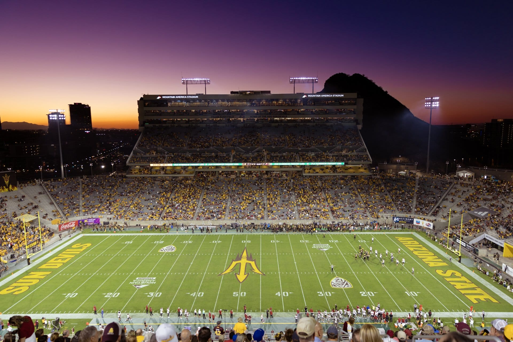
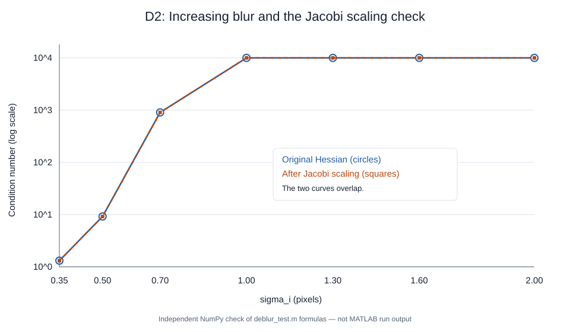
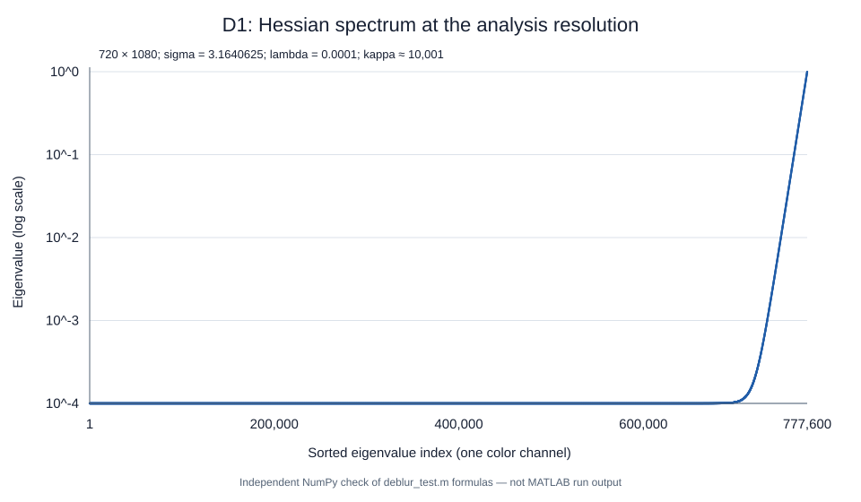
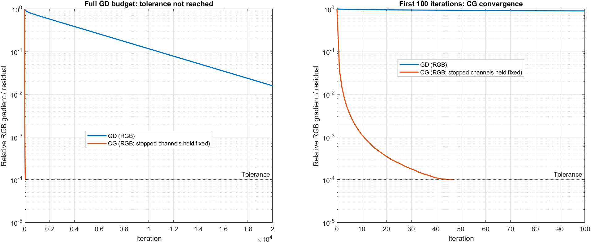
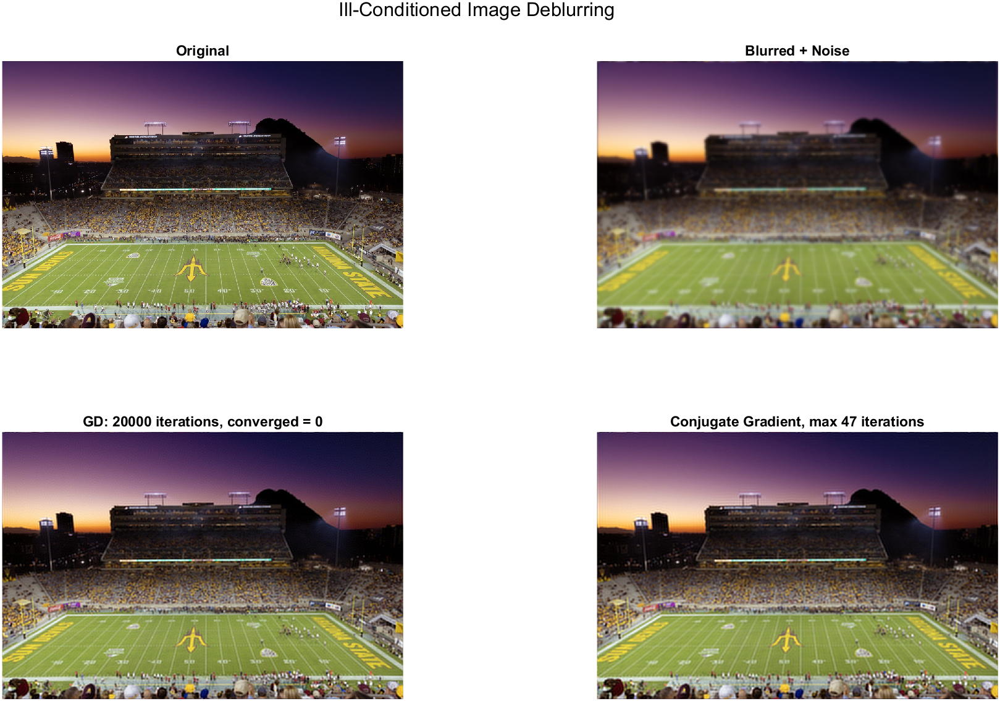
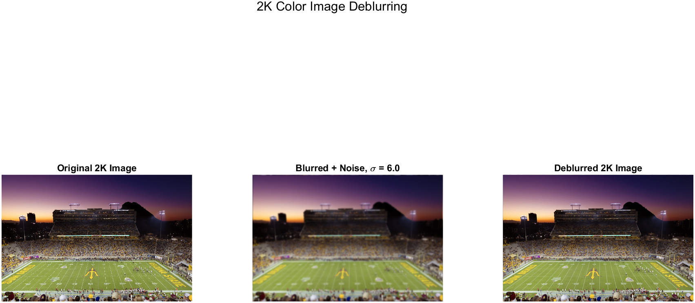

# MAE 494 Fall 2026 — Project 2

Team Name: AI Generated

Contributors: Jack Foster, Danny Lewis

Topic: Ill-Conditioned Optimization in Color Image Deblurring

Assignment: [Project 2 requirements](https://designinformaticslab.github.io/DesignOptimization2025/project2.html)

Original: [deblur_test.m](deblur_test.m) | Working copy: [deblur_report.m](analysis/deblur_report.m) | Python: [deblur_report.py](analysis/deblur_report.py) | Input: [Test_Image.jpg](Test_Image.jpg)

Measured results come from the MATLAB working copy, which preserves the original model and parameters while exporting diagnostics. A Python translation provides an independent implementation check.

## Project Overview

We deliberately blur a known photograph, add small random intensity errors (noise), and try to reconstruct it. The reconstruction is a list of adjustable pixel values. An objective function scores how well those values explain the blurry observation while penalizing excessively large intensities.

We compare two ways to reduce that score: **gradient descent (GD)** and **conjugate gradient (CG)**. Blur makes the score much more sensitive to some image changes than others; this imbalance is called **ill-conditioning**. CG reaches the specified solver accuracy in 40–47 iterations per color channel, while GD does not reach it within 20,000 iterations. Both improve the image-error measure, but CG does not give the lowest image error. Solving the mathematical model accurately and recovering the original photograph accurately are different goals.

The report follows the assignment's four diagnostic checks: D1 measures the range of curvatures, D2 checks why the imbalance is structural, D3 measures GD's slowdown, and D4 compares CG with GD. The equations and code excerpts give the precise definitions behind these checks.

## Problem Identification

A blurred photograph may preserve the overall scene while hiding details such as lettering, field markings, and individual rows of seats. Someone trying to recover useful information from that photograph needs an estimate of the image before the blur occurred. Simply sharpening the picture does not explain whether that estimate is consistent with the blur or how sensitive it is to noise.

Our project studies this problem using the supplied stadium photograph. The broad areas of sky and field vary gradually, while the stadium lettering, seating, and yard lines contain sharper changes. This makes the image useful for explaining why recovering fine detail is harder than recovering broad features.

An imaging engineer or sports-image analyst could use this reconstruction to make field markings and stadium features easier to inspect. The practical tradeoff is recovering useful detail without excessively amplifying noise. Here the known reference photograph lets us measure that tradeoff in a controlled experiment.



*Figure 1. The supplied 1920 × 1281 RGB photograph. This is the input reference, not a reconstruction result.*

The script creates a controlled experiment: it resizes this reference, applies a known Gaussian blur, adds noise, and then estimates the reference image from the degraded image. It therefore tests recovery from **synthetically added blur and noise**. It does not estimate an unknown blur from a photograph taken by an actual blurred camera.

The optimization question is: which pixel values best explain the blurred image while limiting the size of the reconstructed values? The numerical question is why gradient descent can converge slowly on this problem, and whether conjugate gradient handles the same objective more effectively.

## Formulation

### Decision Variables

The decision variable $x$ represents the reconstructed pixel intensities: the numbers the optimizer is allowed to adjust. Each pixel has red, green, and blue (RGB) values. On the normalized intensity scale, 0 means no intensity and 1 means full intensity in a channel. These values are continuous (not restricted to integers) and dimensionless. The solver may produce values outside this display range because it does not enforce pixel bounds.

For the analysis image, all three color channels can be understood as a single vector:

$$x \in \mathbb{R}^{3\,\text{nRows}\,\text{nCols}}.$$

MATLAB stores the image as an array and handles the channels separately where appropriate. This vector notation only explains the existing computation; it does not introduce another variable or change the model. The norms in the objective below mean Euclidean norms over the pixel values.

A vector is simply an ordered list of numbers; stacking the three color arrays into a vector preserves the image information. A Euclidean norm is the square root of the sum of squared entries. Squaring the norm, as in the objective, therefore adds up the squared pixel differences.

Here `nRows = 720` and `nCols = 1080` for the analysis image. MATLAB array dimensions are rows × columns × channels; the table below instead lists the familiar image dimensions, width × height × channels. In the vector formulation, $b$ has the same dimensions as $x$, and $A$ applies the blur independently to the three stacked channels. Unless explicitly stated otherwise, $x$, $b$, $A$, and $H$ refer to this analysis-resolution problem.

| Existing image variable | Role | Dimensions: width × height × channels |
| --- | --- | --- |
| `img` | Supplied image after conversion to double precision | 1920 × 1281 × 3 |
| `xTrue2K` | Resized reference for the direct Fourier solve | 2048 × 1366 × 3 |
| `xTrue` | Resized reference for iterative diagnostics | 1080 × 720 × 3 |
| `xDeblur2K` | Direct reconstruction at the larger resolution | 2048 × 1366 × 3 |
| `xGD`, `xCG` | Reconstructions used in the optimizer comparison | 1080 × 720 × 3 |

The analysis problem has 2,332,800 scalar pixel values. The larger reconstruction has 8,392,704. These dimensions follow from the supplied image and the script's rounding rules; increasing the image width to 2048 does not create new photographic detail.

### Objective Function

The script specifies Tikhonov-regularized least squares:

Here $b$ is the fixed blurry, noisy observation, $A$ is the known operation that blurs an image, and $x$ is the reconstruction being adjusted. The expression $Ax-b$ compares the predicted blurry image with the observed one. The notation $\min_x$ means to choose the pixel values in $x$ that make the score $f(x)$ as small as possible.

$$\min_x f(x) = \frac{1}{2}\lVert Ax-b\rVert_2^2 + \frac{\lambda}{2}\lVert x\rVert_2^2.$$

The first term measures whether applying the blur to the reconstructed image reproduces the observed image. The second penalizes large reconstructed pixel values. It limits the amplification that can occur when attempting to recover information strongly suppressed by blur, but it also biases the solution. The code uses an intensity penalty, not a separate penalty on image derivatives.

The regularization value is fixed at `lambda = 1e-4`. It is a parameter, not a quantity that the optimizer chooses.

The factor $1/2$ simplifies the derivatives and does not affect the minimizing image. The notation `1e-4` means $10^{-4}=0.0001$. The reference photograph is used to generate the experiment and evaluate the result afterward; it is not an input to this objective during reconstruction.

#### Why Tikhonov-Regularized Least Squares?

Tikhonov regularization adds a penalty based on squared values to a least-squares objective to stabilize an inverse problem: recovering a cause (the clear image) from an observed effect (the blurry image). In the identity-penalty form used here, the fit term is $\frac12\lVert Ax-b\rVert_2^2$, and the penalty is $\frac{\lambda}{2}\lVert x\rVert_2^2$. The penalty acts directly on the intensities, which is what “identity” means here. It defines the objective; GD and CG are the algorithms used to minimize that objective.

We use this formulation because Gaussian blur strongly attenuates fine detail. Fitting the noisy observation without regularization can amplify noise in those weakly observed components. The penalty limits this amplification and adds $\lambda$ to every Hessian eigenvalue, improving conditioning and guaranteeing a unique minimizer for $\lambda>0$. The tradeoff is bias toward smaller intensities, so a more stable solution is not necessarily an exact recovery of the reference photograph. The penalty is not the noise itself; the noise is already present in $b$.

Tikhonov regularization was not explicitly taught in the lecture. We use it here as an additional modeling technique for image deblurring, while applying the course's gradient, Hessian, conditioning, and optimization methods to the resulting objective.

#### Gradient and Optimality Condition

The **gradient** lists how the score changes as each pixel intensity changes. The **Hessian** describes how that gradient changes, measuring the objective's curvature or steepness in different directions. For this objective, they are

$$\nabla f(x) = A^\top(Ax-b)+\lambda x,$$

$$H = A^\top A+\lambda I.$$

Setting the gradient to zero gives the system solved by the reconstruction methods:

$$(A^\top A+\lambda I)x=A^\top b.$$

Here $I$ is the identity operator already present in the script's mathematical description. The implementation does not build a dense matrix for $A$ or $H$; it applies their action using Fourier transforms.

The identity operator leaves its input unchanged. The transpose $A^\top$ maps observation mismatches back to the reconstructed pixels; it is not an inverse blur. The final linear system is called the **normal equations**. A Fourier transform represents an image through broad and fine repeating patterns, allowing the code to apply blur efficiently without storing a huge matrix.

### Additional Definitions

| Existing symbol or code name | Meaning and setting |
| --- | --- |
| $A$ | Gaussian circular-convolution operator, applied independently to each color channel |
| $b$, `b2K` | Blurred images with added Gaussian noise at the analysis and larger resolutions |
| `psf`, `psf2K` | Gaussian blur kernels normalized so their entries sum to one |
| `Hf`, `Hf2K` | Fourier transforms of the shifted blur kernels; these are not the Hessian $H$ |
| `sigma2K` | Gaussian standard deviation of 6 pixels in the larger image |
| `analysisScale` | Analysis-to-larger-image width ratio, `1080/2048` |
| `sigma` | Analysis blur standard deviation: `sigma2K*analysisScale` = 3.1640625 pixels |
| `noiseStd` | Added noise standard deviation of 0.001 in normalized intensity units |
| `lambda` | Fixed regularization weight, 0.0001 |
| `eigH`, `hEig` | Arrays containing `abs(Hf).^2 + lambda` |
| `lambdaMin`, `lambdaMax` | Smallest and largest Hessian eigenvalues, distinct from the regularization weight |
| `kappa` | Ratio `lambdaMax/lambdaMin` |
| `alpha` | Fixed gradient-descent step, `2/(lambdaMax + lambdaMin)` |

Although a code comment calls `sigma2K` a blur radius, the Gaussian expression uses it as a **standard deviation**. It is not a finite cutoff radius.

A Gaussian kernel is a set of averaging weights with a bell-shaped profile: nearby pixels contribute more than distant pixels. Applying these weights throughout an image is called convolution. The parameter sigma controls the spread of the weights; larger sigma produces wider blur. “Circular” convolution means the averaging wraps around opposite image edges. `psf` stands for point spread function: how the blur spreads a single bright point.

The script first forms `b2K` from `xTrue2K`. It later resizes the reference to `xTrue` and generates `b` with a fresh noise draw. The analysis observation is therefore not simply a downsampled copy of `b2K`.

### Constraints

The optimization is unconstrained: there are no equality constraints, inequality constraints, integer restrictions, or enforced pixel bounds on $x$.

The `clampImage` function clips values to the interval $[0,1]$ for display. It is applied after solving, rather than as a projection within GD or CG. Consequently, clipping should not be described as a constraint in the optimization formulation. The input to each solver is the unclipped noisy image.

### Classification

This is a continuous, unconstrained, strongly convex quadratic optimization problem. The forward blur model is linear, while the objective is quadratic; this is not a linear programming problem.

The matrix $A^\top A$ is positive semidefinite. Adding the positive `lambda` to every eigenvalue makes $H$ positive definite, so the regularized objective has a unique minimizer. A unique solution can still be difficult to reach with a particular algorithm when the curvature differs greatly between directions.

In plain terms, the objective is a bowl-shaped function with one lowest point. “Quadratic” refers to its squared terms; “strongly convex” means it curves upward in every direction. An eigenvalue measures curvature along a particular direction: positive semidefinite allows zero curvature, while positive definite requires every such curvature to be positive.

## Ill-Conditioning Mechanism

The assignment places image deblurring in **family B**. For this implementation, the source of poor conditioning is the Gaussian blur operator's suppression of spatial detail. See the assignment's [problem menu](https://designinformaticslab.github.io/DesignOptimization2025/project2.html#the-full-menu).

In the stadium image, smooth sky gradients represent slowly varying features. Fine lettering and seat patterns change more rapidly across pixels. The blur weakens those rapidly varying components, so changing them in a candidate reconstruction can produce very little change in the blurred result. The objective is therefore much flatter in some directions than in others.

A direction here means a pattern of changes across pixel intensities, not a horizontal or vertical direction in the photograph. Increasing all intensities by the same amount survives a normalized blur unchanged. In contrast, neighboring positive and negative intensity changes largely cancel during Gaussian averaging. Two candidate images can therefore differ substantially in fine detail while producing nearly identical blurred observations. The data-fitting term strongly distinguishes some changes but barely distinguishes others.

Fourier modes describe these patterns at different spatial frequencies: low frequency means gradual variation across pixels, while high frequency means rapid variation. Circular convolution multiplies each mode by its corresponding entry in `Hf`. The singular values of $A$, which measure how strongly it scales image patterns, are the magnitudes of these entries; the eigenvalues of $A^\top A$ are their squares. Thus the wide range of blur responses becomes a wide range of objective curvatures. The Hessian measures this curvature, and its condition number compares the largest curvature with the smallest.

The code computes the Hessian eigenvalues directly in the Fourier basis:

```matlab
eigH = abs(Hf).^2 + lambda;
lambdaMin = min(eigH(:));
lambdaMax = max(eigH(:));
kappa = lambdaMax/lambdaMin;
```

Squaring the transfer-function magnitude corresponds to $A^\top A$; adding `lambda` shifts every eigenvalue upward. Because the nonnegative blur kernel sums to one, its response to a constant image is one and no Fourier magnitude exceeds one. Thus the largest Hessian eigenvalue is $1+\lambda$, while the smallest is at least $\lambda$:

$$\kappa(H)\le\frac{1+\lambda}{\lambda}=10001.$$

This explains both the large condition number and its upper limit for the current fixed regularization. More blur does not make the regularized condition number grow without bound.

For the main experiment, strongly attenuated modes have `abs(Hf).^2` far below 0.0001, so their curvature is approximately the regularization floor, 0.0001. The constant mode has curvature 1.0001. Their ratio is approximately 10001: the steepest direction has about ten thousand times the curvature of the flattest. Tikhonov regularization therefore makes the minimizer unique and limits the imbalance, but does not make the landscape well-conditioned at the chosen weight.

This curvature imbalance comes from the blur operator and the regularization weight, not from the particular stadium pixels or the added noise. For fixed $A$ and $\lambda$, changing $b$ changes the minimizer and can change the observed convergence history, but it does not change $H$ or its condition number. Noise makes reconstruction more difficult because recovering attenuated components can amplify observation errors; the reported value 10001 is the condition number of the regularized Hessian, not a claim that image noise is amplified by exactly that factor.

### D2 — Intrinsic Conditioning

“Intrinsic” means the imbalance comes from the problem's structure. This check asks whether stronger blur makes the condition number grow and whether simply changing the scale of individual pixel variables can remove it. Jacobi scaling is that per-variable adjustment, based on the Hessian's diagonal entries.

The existing `sigmaList` varies the blur width while holding the analysis dimensions and `lambda` fixed. The following values were first checked independently with NumPy and then confirmed by the MATLAB working-copy run; see the [saved MATLAB results](report_assets/matlab-run/results.json). The image pixels and random noise are not needed for these Hessian calculations.

| `sigma_i` (pixels) | `kappaOriginal` | `kappaJacobi` |
| --- | ---: | ---: |
| 0.35 | 1.31016 | 1.31016 |
| 0.50 | 9.19180 | 9.19180 |
| 0.70 | 902.89698 | 902.89698 |
| 1.00 | 9996.72094 | 9996.72094 |
| 1.30 | 10000.99999 | 10000.99999 |
| 1.60 | 10001.00000 | 10001.00000 |
| 2.00 | 10001.00000 | 10001.00000 |



*Figure 2. Independent check of the script's D2 formulas. The original and rescaled curves overlap. Values near the upper limit have been rounded.*

The table shows substantial growth from weak to stronger blur, followed by saturation near the regularization limit. The sweep ends at 2 pixels; the main analysis setting, 3.1640625 pixels, is separate and lies beyond that sweep.

Within this sweep, `sigma_i` is one entry of `sigmaList`, `psf_i` is its normalized kernel, and `eigHi` is its Hessian spectrum. `kappaOriginal` and `kappaJacobi` denote the condition numbers before and after diagonal rescaling, respectively; both include the same fixed regularization.

For circular convolution, each pixel is treated by the same shifted kernel. Every diagonal entry of the spatial Hessian is therefore the same. The script calculates this shared value and the rescaled eigenvalues using

```matlab
diagH = sum(psf_i(:).^2) + lambda;
eigScaled = eigHi/diagH;
```

All eigenvalues are divided by the same positive scalar, so their largest-to-smallest ratio does not change. Diagonal scaling cannot remove the large condition number in this model. This is the structural issue tested by the assignment, rather than a mismatch between the units of different pixels.

## Effect of Ill-Conditioning

### D1 — Spectrum

The spectrum is the collection of Hessian eigenvalues. Its spread shows how different the curvatures are. A logarithmic axis displays equal multiplicative changes at equal distances, making small and large eigenvalues visible on the same plot.

At `sigma = 3.1640625`, the MATLAB run confirms the independent check:

| Existing quantity | Checked value |
| --- | ---: |
| `lambdaMin` | Approximately 0.0001 |
| `lambdaMax` | Approximately 1.0001 |
| `kappa` | Approximately 10001 |
| `alpha` | Approximately 1.99960008 |



*Figure 3. Independent check of the D1 spectrum, using the script's 10,000-point sampling rule. The eigenvalues belong to one color channel; all three channels have the same spectrum.*

Many eigenvalues lie near the regularization floor, while a smaller portion extends toward 1.0001. This wide range is the numerical expression of the difference between weakly observed detail and strongly observed broad image features.

### D3 — Baseline: Gradient Descent

The baseline is fixed-step, full-gradient descent: it repeatedly adjusts all pixel values in the direction that locally reduces the score fastest. One update is an iteration. The step size $\alpha$ stays constant, and the update is

$$x_{k+1}=x_k-\alpha\nabla f(x_k).$$

Here $k$ counts iterations and $x_0=0$ is the initial black image. For this quadratic problem, the code uses Fourier formulas to calculate the same trajectory without explicitly executing every pixel-space update. The relevant quantities are

```matlab
alpha = 2/(lambdaMax + lambdaMin);
hEig = abs(Hf).^2 + lambda;
rho = 1 - alpha*hEig;
```

`rho` describes how each Fourier component of the error relative to the regularized minimizer changes in one iteration; this is not the error relative to the reference photograph. Components with magnitude close to one decay slowly. Here `absRho = abs(rho)`, and `rhsEnergy` sums the squared Fourier magnitudes of $A^\top b$ across all three channels. The code calculates `relativeGradientGD` from `rhsEnergy` and powers of `absRho`. Fourier normalization cancels in this relative norm.

At iteration $k$, the plotted relative gradient is $\lVert\nabla f(x_k)\rVert_2/\lVert\nabla f(x_0)\rVert_2$, with $x_0=0$. The normal-equation residual $A^\top b-Hx_k$ is the negative gradient, so its relative norm is the same quantity. This solver residual is distinct from the image-fitting residual $Ax_k-b$ in the objective.

For the checked spectrum, the largest magnitude of `rho` is about 0.99980004. Raising that factor to 20,000 gives about 0.018323. This describes a worst-mode contraction factor, **not a measured gradient residual or reconstruction error for the photograph**. It explains why the script's 20,000-iteration limit does not guarantee the requested tolerance.

The connection to GD is direct: one fixed step size must remain stable in the steep directions, leaving small updates in the shallow directions. With the chosen step, the smallest-curvature mode has `rho` approximately +0.99980004, while the largest-curvature mode has `rho` approximately -0.99980004. The former decays slowly without alternating sign; the latter alternates sign and also decays slowly. These values explain how the same curvature imbalance produces slow progress even with the optimal worst-case fixed step for this quadratic.

The existing controls are `gdTolerance = 1e-4` and `maxGDIterations = 20000`. In the original script, iterations are sampled logarithmically. If a sampled value first passes the tolerance, `gdIterations` reports that sampled index, not necessarily the earliest successful iteration. If no sample passes, it is set to 20,000 and the script prints a failure-to-converge message. That value must not be reported as successful convergence without checking the message.

The tolerance is the stopping threshold: the gradient norm must fall to at most 0.0001 of its initial value. It is not a requirement that the reconstructed photograph have only 0.01% image error. Logarithmic sampling uses closely spaced checks early on and wider spacing later. The working copy's binary search repeatedly halves the possible iteration range to locate the first successful integer iteration when one exists within the budget.

The working copy checks the full-budget residual first and uses an integer binary search if the tolerance is reachable. This preserves the same GD trajectory and budget while distinguishing an iteration cap from convergence.

**Measured result:** GD did not meet the tolerance. At 20,000 iterations, its relative RGB gradient was **0.01582584**, approximately 158 times the requested 0.0001. A two-variable contour-path plot is not applicable to this image with millions of decision values.



*Figure 4. MATLAB working-copy results. Both curves use the RGB relative gradient/residual norm. The right panel makes the early CG behavior visible; the left shows GD across its complete budget.*

## Proposed Solution and Demonstration

### D4 — Improvement: Conjugate Gradient

The proposed optimizer comparison is conjugate gradient on the same regularized normal equations. It uses the Hessian's structure to construct conjugate search directions rather than repeatedly following the steepest-descent direction. This can reduce the number of iterations needed for an ill-conditioned positive-definite quadratic.

CG uses previous progress to choose new directions that are mutually orthogonal when measured using the Hessian; these are called conjugate directions. In exact arithmetic, this structure prevents later searches from undoing the minimization along earlier directions. A preconditioner would transform the system to improve its conditioning, but none is used here.

The implementation uses `pcg` with `cgTolerance = 1e-4` and `maxCGIterations = 500`. Despite the function name, the call supplies **no preconditioner**. It is an unpreconditioned CG comparison. The default initial estimate is zero, and the three color channels are solved separately.

The Fourier representation makes the Hessian-vector operation inexpensive through `Hmult`. It does not change the Hessian eigenvalues or reduce `kappa`. The improvement to demonstrate here is convergence behavior, not a claim that the change of basis cured the conditioning.

For each channel, the script prints `iterationsCG`, `relres`, and `flag`. A zero flag indicates successful convergence; the iteration count alone is insufficient to establish success. `maxCGUsed` is the largest per-channel count, not the sum of work across all channels.

The original script stores only the red channel in `cgHistory`, whereas GD combines all three channels. The working copy fixes this reporting mismatch: it saves all three residual histories, combines their squared norms, and divides by the initial RGB norm. Once a channel stops, its last residual is held fixed in the aggregate curve.

| Channel | CG iterations | Relative residual | MATLAB flag |
| --- | ---: | ---: | ---: |
| Red | 40 | 0.00009966508 | 0 |
| Green | 42 | 0.00009963335 | 0 |
| Blue | 47 | 0.00009688040 | 0 |

All three channels met the tolerance. The final combined RGB residual was **0.00009900521**. CG therefore met the target within 47 iterations per channel, while GD still failed it after 20,000 iterations. This is an iteration-based comparison; a CG step is performed separately for each channel, and no wall-clock speedup ratio is claimed.

The condition number remains **10001 for both methods**. CG improves the effective convergence rate by combining information from previous search directions, allowing it to handle the different curvatures more effectively. For positive-definite quadratics, the usual worst-case iteration bound for a fixed reduction in the Hessian energy norm of the solution error scales with the square root of the condition number for CG, versus the condition number for optimally stepped GD. These bounds explain the choice of remedy; they do not predict the exact residual history of this image.

The Hessian energy norm measures solution error while giving more weight to errors in steeper directions. A worst-case bound is a theoretical guarantee under the stated assumptions, rather than a prediction of the exact iteration count for this photograph.

The measured iteration counts provide the direct D4 comparison: CG reaches the fixed tolerance within 47 iterations per channel, while GD requires more than its 20,000-iteration budget. Thus the ratio of GD's required iteration count to the largest CG count is greater than 425, without implying an equivalent runtime improvement. The exact GD count to tolerance was not measured.

### Larger Image: Direct Fourier Reconstruction

The 2048-pixel-wide reconstruction uses `spectralDeblurRGB`, not CG. In each color channel, it computes

```matlab
Xf = conj(Hf).*Bf ./ (abs(Hf).^2 + lambda);
```

and transforms the result back to pixel space. In this helper function, `b` and `Hf` are local argument names: for the larger reconstruction, the caller passes `b2K` and `Hf2K`. `Bf` is the Fourier transform of one channel of that observation, and `Xf` is the Fourier transform of its reconstructed channel. This directly solves the regularized normal equations for the periodic blur model at the larger resolution. The resulting `xDeblur2K` is separate from the smaller `xCG` image.

`directSolveTime` measures this direct solve. The script does not time GD and CG, and GD is evaluated through sampled closed-form expressions. A wall-clock comparison between these paths would not measure equivalent iterative implementations.

### Measured Reconstruction Quality

Optimization accuracy and photographic fidelity are different. A small gradient or residual means the regularized equations have nearly been solved; it does not mean the original photograph has been recovered exactly.

The script's `errorBlur`, `errorGD`, `errorCG`, and `error2K` are relative image errors against the corresponding resized reference. These errors use **clipped display images**. They are not objective-function values or solver residuals, and the larger-image error is measured at a different resolution from the iterative errors.

Each relative image error is the norm of the difference from the reference divided by the norm of that reference. Smaller is better, and zero means an exact match. For example, 0.17448852 is about 17.45% by this norm-based measure; it does not mean that 17.45% of pixels are incorrect. Clipping replaces values below 0 with 0 and values above 1 with 1.

| Measured quantity | MATLAB result |
| --- | ---: |
| Blurred analysis image: `errorBlur` | 0.17448852 |
| GD reconstruction: `errorGD` | 0.12399872 |
| CG reconstruction: `errorCG` | 0.13058171 |
| Direct 2K reconstruction: `error2K` | 0.14457829 |
| Direct 2K solve time, one run | 0.894 seconds |

Both iterative reconstructions reduced the clipped image error relative to the blurred input. CG met its solver tolerance much sooner, but its image error was slightly higher than GD's in this run. Solving the regularized equations more accurately does not guarantee a smaller error against the reference photograph. The current fixed regularization and stopping rules have not been optimized for image quality.



*Figure 5. Original, degraded, GD, and CG analysis images. GD's 20,000 iterations are a budget limit, not successful convergence. Broad features and some field detail return, but fine photographic detail is not completely restored.*



*Figure 6. The 2048-pixel-wide direct reconstruction is a separate solve at a different resolution. It is not the CG image from Figure 5.*

## Assumptions and Simplifications

The following choices already exist in the script; no additional model assumptions are introduced here.

- **Known, spatially uniform Gaussian blur.** The same kernel applies throughout an image and independently to each channel. The experiment does not estimate a spatially varying blur or motion blur.
- **Periodic boundaries.** Fourier multiplication implements circular convolution, so opposite image edges interact. The stadium photograph is not inherently periodic; this may affect its boundary reconstruction.
- **Synthetic Gaussian noise.** Noise is generated by `randn` with `noiseStd = 0.001` and a fixed `rng(1)` seed. This does not model every source of camera noise or compression artifacts.
- **Fixed regularization.** The script uses `lambda = 1e-4` without a parameter-selection study. Better conditioning is obtained at the cost of regularization bias; the code does not establish this value as optimal.
- **Resized reference images.** The input is treated as the known reference after resizing. Its pre-existing photographic imperfections remain part of that reference.
- **Separate analysis resolution.** Diagnostics use 1080-pixel width and the corresponding scaled blur. The same mathematical form is retained, but the diagnostic image and noise realization differ from the larger case.
- **Post-solve clipping.** Display clipping affects the reported image errors without changing the unconstrained solution process.

## Reproducibility

The instructions below let another person repeat the experiment. A fixed random seed makes the generated noise repeatable within the same implementation. Saved measurements and figures allow the reported outcomes to be checked without rerunning the full image calculations.

The measurements were generated with MATLAB R2023b Update 9 and Image Processing Toolbox using the supplied `Test_Image.jpg`. The original MATLAB source is preserved, and the working copy provides the reproducible report outputs.

From the repository root, run the separate copy:

```matlab
addpath('analysis');
results = deblur_report(fullfile(pwd,'analysis','results_matlab'));
```

It locates `Test_Image.jpg`, uses the original `rng(1)` sequence, and exports its figures, log, JSON measurements, and reference arrays. The original script still looks first for `stadium.png` and falls back to a picker; that original file was not edited. Full instructions and dependencies are in [analysis/README.md](analysis/README.md).

### Python Translation and Validation

```text
python -m pip install -r analysis/requirements.txt
python analysis/deblur_report.py --output analysis/results_python
python -m unittest discover -s analysis -p "test_*.py" -v
```

The standalone translation keeps the model and parameter values. Its bicubic preprocessing matched the two MATLAB reference images within 1.6e-13 maximum absolute difference. NumPy's seeded noise differs from MATLAB's seeded noise, so two independently generated experiments need not return identical pixels.

For a stricter solver comparison, Python also ran on the exact references and noisy observations exported by MATLAB, using `--reference-mat`. The two implementations returned the same 40/42/47 CG counts. Maximum absolute reconstruction differences were 8.33e-15 for GD, 2.26e-14 for CG, and 1.12e-14 for the direct solve. These checks validate the translation on this case; they are not a general proof for every input or software version.

The standalone Python run also completed, returning the same CG counts and GD nonconvergence status with its own noise sample. Saved [shared-input results](report_assets/python-shared-input-results.json), [standalone results](report_assets/python-standalone-results.json), and [validation details](report_assets/translation-validation.json) keep those experiments distinct.

### Small-Case Verification

As a check on the formulas, use a 2-by-2 grid with the blur width 0.5 pixels selected from `sigmaList` and `lambda = 0.0001`. This is a separate verification case; the main image experiment retains `sigma = 3.1640625` and its full analysis dimensions. The 2-by-2 case is not the 720-by-1080 D2 sweep, so its condition number need not match the D2 table at the same blur width.

The same shifted, normalized Gaussian formula gives

$$\text{psfShifted}=\frac{1}{(1+e^{-2})^2}\begin{bmatrix}1&e^{-2}\\e^{-2}&e^{-4}\end{bmatrix}.$$

The 2-by-2 Fourier transform is obtained by adding and subtracting these four entries. Its values are approximately 1, 0.76159416, 0.76159416, and 0.58002566. Squaring them and adding 0.0001 gives Hessian eigenvalues 1.0001, 0.58012566, 0.58012566, and 0.33652976. Their ratio is **2.97180251**. An explicit 4-by-4 circular-blur matrix independently produced these same eigenvalues.

Five numerical tests passed: the small Hessian check, direct GD steps against the Fourier trajectory, CG against the direct solution, stopping/zero-gradient cases, and resize identity/constant-image cases. These tests supplement the full-image cross-language comparison.
